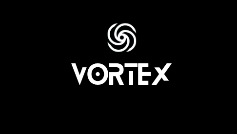

# PLANNER VORTEX
Bem vindo à documentação do Planner Vortex!

Aqui você encontrará diversas informações sobre este projeto, como objetivo, causas, criadores, tecnologias implementadas e mais. Boa leitura!

## Índice
* [Introdução](#%EF%B8%8F-introducao)
* [Objetivo](#%EF%B8%8F-objetivo)
* [Tecnologias implementadas](#%EF%B8%8F-tecnologias-implementadas)
* [Ambientes de desenvolvimento](#%EF%B8%8F-ambientes-de-desenvolvimento)
* [Sites auxiliares](#%EF%B8%8F-sites-auxiliares)
* [Visualizar o projeto](#%EF%B8%8F-visualizar-o-projeto)
* [Desenvolvedores](#%EF%B8%8F-desenvolvedores)

# Introdução
- texto vai aqui 
 

# Objetivo
O projeto Vortex foi criado para auxiliar e acompanhar seus usuários no dia a dia, facilitando a organização e identificação de atividades em geral, sendo uma ferramenta simples e intuitiva.

## ⚙️ Tecnologias implementadas

- ``Python``
> Utilizado no back-end do sistema.
- ``HMTL``
- ``CSS``
- ``JavaScript``
> Utilizados no front-end do sistema.
---

## 🌌 Ambientes de desenvolvimento

- ``Visual Studio Code``
- ``Replit``

## 🌠 Sites utilizados

- ``Github``
- ``Heroku``
- ``Replit``

## 👨🏻‍🎓 Desenvolvedores

| [ Ian Vinícius Vasconcelos](https://github.com/NerdAleatorio) |  
| :---: | 

 | [ Samuel Alves](https://github.com/B4N64) |  
| :---: | 

| [ Thiago Tomé](https://github.com/NerdAleatorio) |  
| :---: | 

| [ Yuri Gabriel](https://github.com/NerdAleatorio) |  
| :---: | 
---

